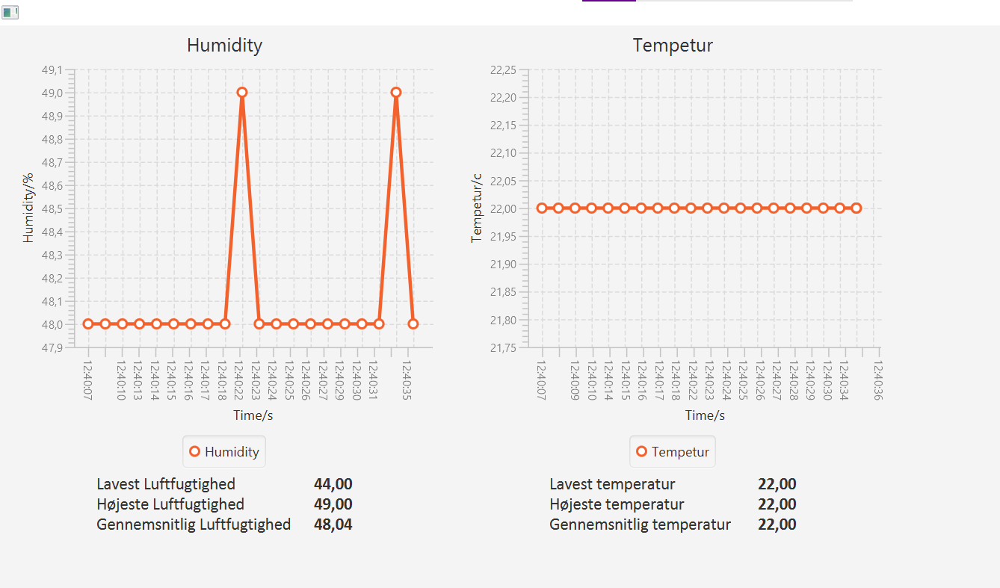

# Addict_PC_Light_Server

This project contains a python server on a raspberry pi and a java client on another device communicating.

The raspberry pi makes use of a humidity and temperature sensor and the server sends the data from the sensor to the clients connected to it.

Vi antager at en fugtigheds og temperatur måler ville gavne sig bedst til at regulere air condition
for at skabe et optimalt lærings miljø. Alternativt kunne det bruges til at regulere de samme faktorer
i et drivhus miljø for at kultivere plante med let påvirkelige livs cyklus.

## Protokoller
Der er valgt at bruge tcp/ip da det er mest praktisk da mængden af data vi sender er så lille
at den lange tcp/ip process ikke gør en forskel.

## Mangler
Under udviklingen af vores app er det ikke implementeret fejlsikring i forhold til verificering
af data som langt afvigende data sæt.

## Forbedringer
Vi kunne sætte grænse værdier som værdierne ideelt skal holde sig imellem, eventuelle advarsler til
brugere hvis dataen afviger for meget og dermed kræver deres invendelse.

## Developers
Anders Hjordrup Larsen  
Fredrik Bille  
Chilas Dipo  
Lasse Jørgensen Kongsdal